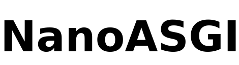

#  NanoASGI: Asynchronous Python Web Framework

NanoASGI is a fast, simple and lightweight [ASGI](https://asgi.readthedocs.io "Asynchronous Server Gateway Interface") micro web-framework for Python. It is distributed as a single file module and has no dependencies other than the [Python Standard Library.](http://docs.python.org/library/)

## Download and Install
Download nanoasgi.py into your project directory. There are no hard dependencies other than the Python standard library. NanoASGI runs with Python versions above 3.7.

## License
Code and documentation are available according to the MIT License (see [LICENSE](license)).

The Bottle logo however is NOT covered by that license. It is allowed to use the logo as a link to the repo or in direct context with the unmodified library. In all other cases, please ask first.

[LOGO](#logo) - [Perditax](https://commons.wikimedia.org/wiki/File:C20_Fullerene.png), CC0, via Wikimedia Commons
